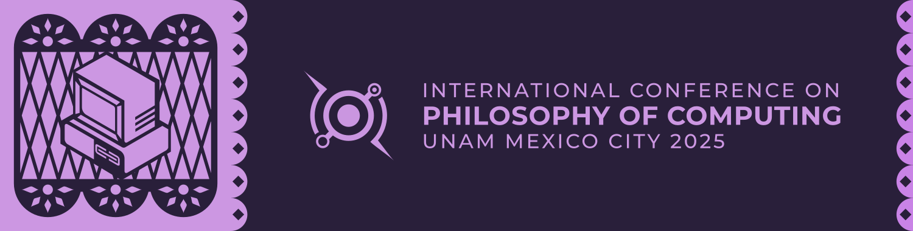

# PHILCOMP 25 Materials
 - [x] Program preview
 - [ ] Full program
 - [ ] Add speakers to database
 - [ ] Sessions calendar
 - [ ] Talkcards (Title + author + time + session)
 - [ ] ID Badges
 
## How to build
1. Set up a virtual environment and install dependencies as usual. [uv](https://github.com/astral-sh/uv) usage is highly recommended:
```sh
uv venv
uv pip install -r requirements.txt
```
Make sure to also install the [Typst compiler](https://github.com/typst/typst) for your system beforehand.

2. Set up the source tables into a `.env` file, these are privately shared to the collaborators on demand:
```
URL_PRESENTATIONS="https://docs.google.com/spreadsheets/d/.../export?format=csv&gid=..."
URL_SESSIONS="https://docs.google.com/spreadsheets/d/.../export?format=csv&gid=..."
URL_SPEAKERS="https://docs.google.com/spreadsheets/d/.../export?format=csv&gid=..."
URL_ABSTRACTS="https://docs.google.com/spreadsheets/d/.../export?format=csv&gid=..."
```

2. Get into your virtual environment and issue:
```sh 
python build.py
```
this will automatically download all of the required data, build a sqlite database, query for the needed information in the correct format and compile the documents from the Typst templates into an `output/` directory.
